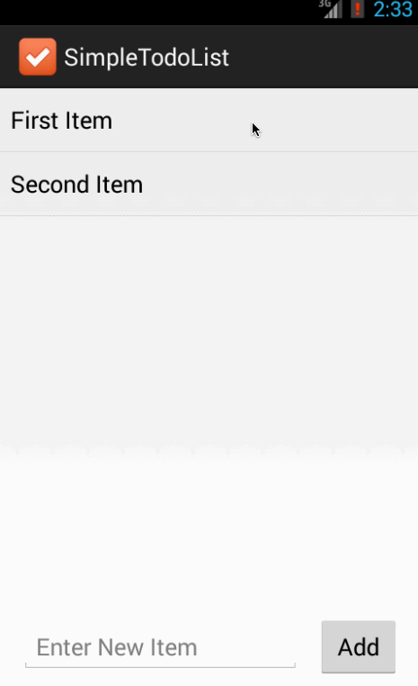

Android training project 0: Simple todo list
==========================

This is an Android application for a simple todo list. User can view a list of todo items, and modify the list by add/remove items.

Time spent: 1.5 hour spent in setting up android environment, 1 hour spent in creating the app

Completed user stories:

 * [x] Required: User can view a list of existing todo items
 * [x] Required: User can add a new item to the todo list
 * [x] Required: User can remove an item from the todo list

Walkthrough of all user stories:

GIF created with [LiceCap](http://www.cockos.com/licecap/).
